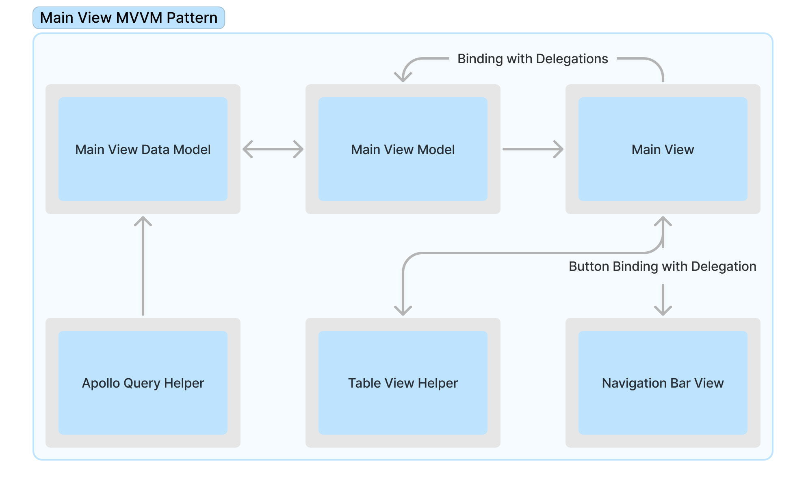
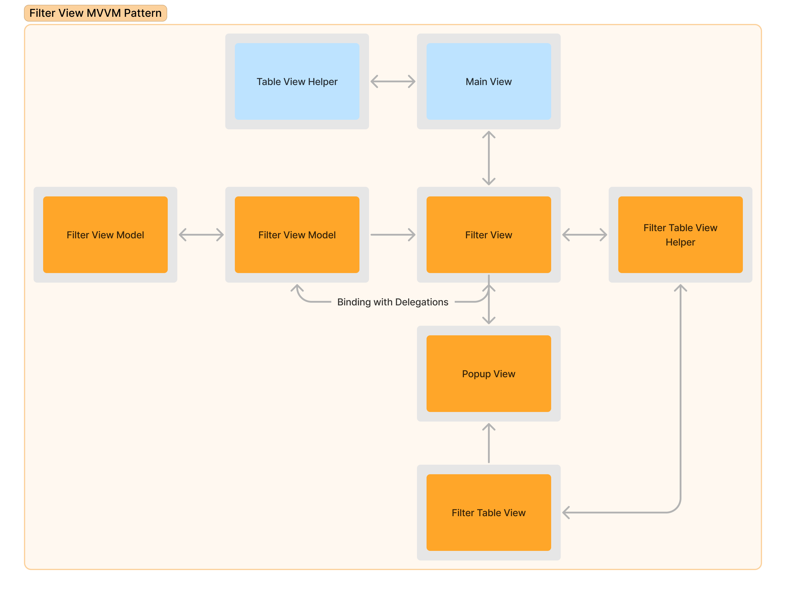

## Abstract

In this application Rick and Morty (TV show) characters fetched from GraphQL's Rick and Morty RestAPI using Apollo GraphQL wrapper for iOS. Fetched information can be filtered for Rick or Morty characters. Image, name, location and ID informations that fetched from RestAPI, presented with programmatic UIKit, auto layout  assisted with SnapKit via following MVVM pattern.

Imported Roboto font as applications font.

## Method

### Installing Dependencies

SnapKit and Apollo installed via CocoaPods. SnapKit requires no other step after "pod install". In the other hand Apollo requires extra files and script to execute GraphQL queries. After following steps in this [documentation](https://www.apollographql.com/docs/ios/tutorial/tutorial-introduction). For CocoaPods, corresponing run script must be added to Xcode for Apollo. 


### Queries
After Apollo installation is completed, GraphQL gueries can be executable. To get required data following query is requested.
```graphql
query Characters{
  characters {
    results{
        id
        name
        image
        location{
            name
      }
    }
  }
}
```
Then query is mapped to an struct to be represented in Swift.


### Main View

In Main view custom Navigation Bar that displays title and filter button; fetched data is displayed on custom Table View. Table View has a custom Table View Cell that holds a UIImageView, a View Container, 3 title labels and 3 data labels. ImageViews top corners; Container Views bottom are set to be rounded. A drop shadow is added to containter view by using a UIView extension. 

Table View has a helper class to perform methods. When data fetched, TableView shows corresponding amount of custom table cells. Regaring to seleceted filter tag, cells with matching name to tags are filtered from all data and displayed.

To display images on UIImageView, fetched image URLS are downloaded on an async thread and displayed. Downloading and rendering on reuseable cell causes a stutter when scrolling on Table View. To counter this, Downloaded images are stored on a global cache, if a required image exists on cache, it pulled from cache rather than being downloaded again. Downloaded images get cropped to achieve required look.

When user pressed on filter button on Navigation Bar, a delegation method gets invoked Main View presents Filter View.

 

### Filter View

Filter View contains a popup view that has a label and a tableView. Filter View uses a Table View Helper class to handle methods on popup views table view. Data on table view displayed regarding to 
filter tags (Rick and Morty). Table View uses custom Table View Cell, on cell there is a label and a UIView that indicates selection. 

If a filter tags is already seleceted, corresponding tableView cell gets highlighted by indicator. Already selected information is fetched from Main View and setted on Filter View Data Model using Filter View Model. When user selects a filter, a delegation invokes and transfers tag information to Filter View, then another delegation invokes and transfers tag info to Main View and dismisses Filter View.

If user selects same filter tags cell, selected tag setted to nil on Main Table View.

 
